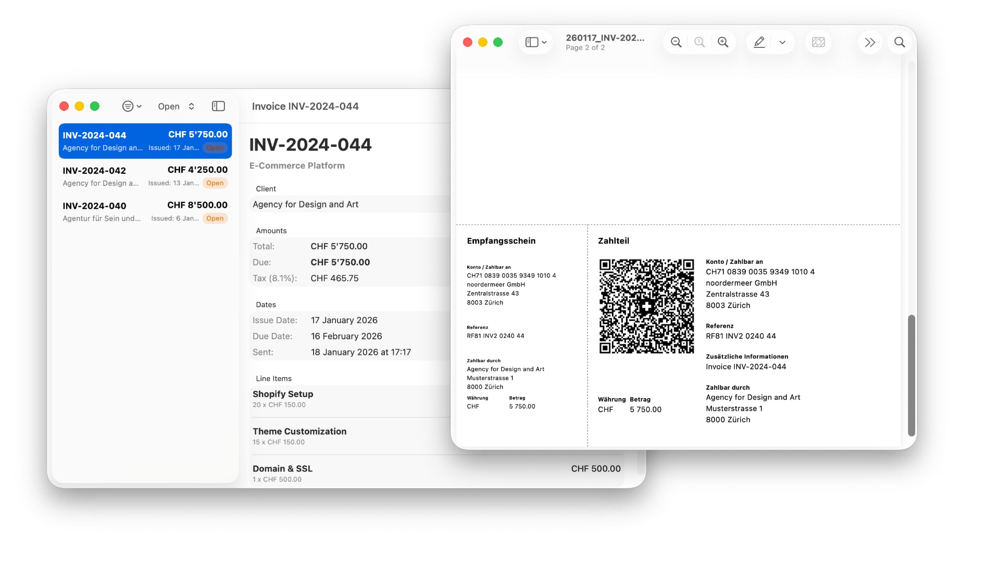

<p align="center">
  <!-- TODO: Add logo -->
  
</p>

<h1 align="center">HarvestQRBill</h1>

<p align="center">
  A macOS app that generates Swiss QR Bills for <a href="https://www.getharvest.com/">Harvest</a> invoices.
</p>

<p align="center">
  ✨<a href="https://github.com/jorisnoo/HarvestQRBill/releases/latest">Download</a>✨
</p>

---

<p align="center">
  
</p>

## Features

- Connect to your Harvest account to fetch invoices
- Generate Swiss QR Bills compliant with the Swiss Payment Standards
- Automatic SCOR reference generation (Creditor Reference ISO 11649)
- Export invoices with QR payment slip as PDF
- Secure credential storage in macOS Keychain
- Native macOS app built with SwiftUI

## Requirements

- macOS 14.0 (Sonoma) or later
- Harvest account with API access

## Installation

### Download

Download the latest release from the [Releases](https://github.com/jorisnoo/HarvestQRBill/releases/latest) page.

### Build from Source

```bash
git clone https://github.com/jorisnoo/HarvestQRBill.git
cd HarvestQRBill
open HarvestQRBill.xcodeproj
```

Build and run with Xcode 15+.

## Setup

1. Open HarvestQRBill
2. Go to **Settings**
3. Enter your Harvest credentials:
   - **Account ID**: Found in Harvest under Settings → Account
   - **Access Token**: Generate at [id.getharvest.com/developers](https://id.getharvest.com/developers)
4. Configure your creditor details (name, address, IBAN)
5. Start generating QR Bills!

## Usage

1. Select an invoice from the list
2. Review the QR Bill preview
3. Click **Export PDF** to save the invoice with the QR payment slip

## Swiss QR Bill Compliance

This app generates QR Bills according to the [Swiss Payment Standards](https://www.paymentstandards.ch/):

- QR-IBAN or standard IBAN support
- SCOR (Creditor Reference) format
- Structured address format
- CHF and EUR currencies

## Development

### Release Workflow

Releases are automated via GitHub Actions:

```bash
# 1. Make changes with conventional commits
git commit -m "feat: new feature"

# 2. Run Shipmark to bump version and create tag
shipmark release

# 3. Push to trigger the release workflow
git push --follow-tags
```

GitHub Actions will automatically:
- Build and code sign the app
- Create a notarised DMG
- Publish a GitHub Release with changelog

## License

MIT – see [LICENSE](LICENSE) for details.

## Acknowledgments

- [Harvest](https://www.getharvest.com/) for their API
- Swiss Payment Standards for QR Bill specifications

## Disclaimer

"Harvest" is a trademark of Iridesco, Inc. This project is not affiliated with or endorsed by Harvest.

This project was developed with the assistance of [Claude](https://claude.ai), an AI assistant by Anthropic.
